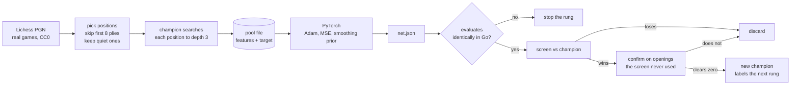
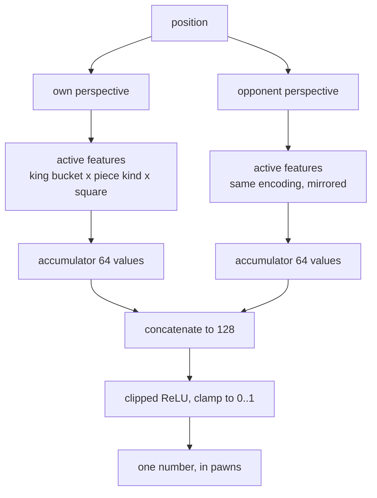

# How the network is trained

The engine never learns from anyone else's evaluation. A position's label is
what **this engine's own search** said about it, so the network is a
compression of the current champion's search into something that costs one
pass instead of thousands of nodes.

## The loop



The champion that labels a rung is the champion the rung must then beat. That
is the whole mechanism: no outside evaluation enters at any point.

## Inputs

The feature set is HalfKP. A position is described **twice**, once from each
side's point of view, and each description is a list of active features of the
form *(where my king is, what piece, on which square)*.

### In plain terms

Think of a checklist of 5120 yes/no switches. Only about thirty are ever on at
the same time, one per piece on the board.

Every switch asks the same shaped question:

> is there a **[piece kind]** on **[square]**, given my king is in **[area]**?

- **piece kind**: 10 options, being pawn / knight / bishop / rook / queen,
  each either mine or theirs. Kings are not in the list, because the king's
  own position is already the third part of the question.
- **square**: 64 of them.
- **king area**: the 64 king squares folded into 8 groups.

10 x 64 x 8 = 5120 switches.

**Why drag the king into every question?** Because the same piece is worth
different things depending on where your king is. A knight on f5 is dangerous
when your king is castled kingside and close to irrelevant when it is on the
queenside. Instead of hoping the network works that out, the encoding gives
"enemy knight on f5" a different switch for each king area, so it can learn a
separate opinion for each.

**Why 8 areas and not 64?** One switch per exact king square would mean 40,960
switches, and each would be seen eight times less often in training. Folding
similar king squares together trades a little precision for a lot of data per
switch.

**Why describe the position twice?** Once from each side, so the network
learns in terms of "my pieces" and "their pieces" rather than white and black.
The same position with the colours swapped then looks identical to it, which
halves what it has to learn.

**Why switches rather than 64 numbers, one per square?** Because a move flips
only two of them: the piece leaves one square and arrives at another. The
hidden layer can be updated by subtracting one row and adding another instead
of being recomputed. That is the whole reason a network is affordable inside a
search that visits millions of positions.



| | |
|---|---|
| king buckets | 8 (the 64 king squares folded into 8 classes) |
| piece kinds | 10 (5 types x 2 colours, kings excluded) |
| squares | 64 |
| **inputs per perspective** | 8 x 10 x 64 = **5120** |
| first layer | 5120 x 64 = 327,680 weights |
| hidden | 64 per perspective, 128 concatenated |
| output layer | 128 weights, 1 bias |

Only a handful of inputs are non-zero (one per piece on the board), so the
first layer is never multiplied out. The accumulator is updated incrementally
as moves are made and unmade, which is what makes the network affordable
inside a search.

### A second hidden layer

`--hidden2 N` inserts a clipped layer between the concatenated accumulator and
the output, so the shape becomes 5120 -> 64 -> 128 -> N -> 1. Real NNUE does
this (256x2 -> 32 -> 32 -> 1), and it is the one architecture change that
alters what the network can express: a single clipped-linear layer can only
add up one opinion per piece, which is why width 64 to 128, king buckets 8 to
32 and averaging two networks all stopped at the same 91% of the teacher
explained. A second layer represents interactions between pieces instead.

```
.venv/bin/python pytorch/train.py --pool clean_r9.bin --out nets_torch/r10_h2.json \
  --hidden 64 --hidden2 32 --loss sigmoid --k 0.3 --average-best 3 --epochs 0 --patience 8
```

The exported JSON carries the layer in `h2`, `wh2` and `bh2`, so the engine
picks it up with no flag of its own. A network trained without it writes none
of those keys and loads exactly as it always did. Only the layers above the
accumulator changed; the incremental update is untouched.

## Output

**One number: the position's value in pawns**, from the side to move.

It is deliberately *not* a win probability. A network emitting probabilities
has to be inverted by the search, and inverting amplifies: an error of 0.11 at
p=0.95 is four pawns. Training against win probability instead of pawns was
tried and measured worse, at -37 Elo.

At play time the number is blended with the hand written evaluation:

```
score = 0.45 x hand_eval + 0.55 x network
```

0.45 is measured, not chosen. The network alone, and every other weighting
tried (0.0, 0.2, 0.3, 0.55, 0.6, 0.65), played worse.

## The target

```
target = the champion's search score for that position, in pawns, clamped to +/-12
```

Three things about it were settled by matches rather than argument:

| question | answer | evidence |
|---|---|---|
| how deep should the labelling search go? | depth 3 | depths 3, 5 and 8 measured the same, and 3 labels 14x faster |
| mix in the game's result? | no | lambda 0.8 measured -29 and lambda 0.5 -52 against pure search scores |
| which positions? | quiet ones | a static function cannot learn tactics; positions where quiescence disagrees with the static score by more than 0.35 pawns are dropped |

## Training details

- **Loss**: mean squared error on pawns.
- **Split**: 15% held out **by game**, never by position, because consecutive
  positions in one game are near duplicates and splitting by position leaks.
- **Smoothing prior**: each square's weights are pulled toward its neighbours'
  after every epoch. Worth about +56 Elo, the single largest training-side
  effect ever measured here.
- **Stopping**: when the held-out loss stops improving by a fraction of the
  constant-predictor loss. A fraction, not an absolute number, because the
  size of the loss depends on which loss you use.
- **Contract**: the exported network must evaluate identically in Go, checked
  on a set of positions before the rung is allowed to race.

## What the numbers look like

A trained rung explains about 90% of the variance in its teacher's search
scores. The remaining 10% is mostly tactics, which piece placement cannot
predict: doubling the hidden layer to 128 moved it to 90.3% from 90.2% and
lost Elo, so capacity is not the constraint.
